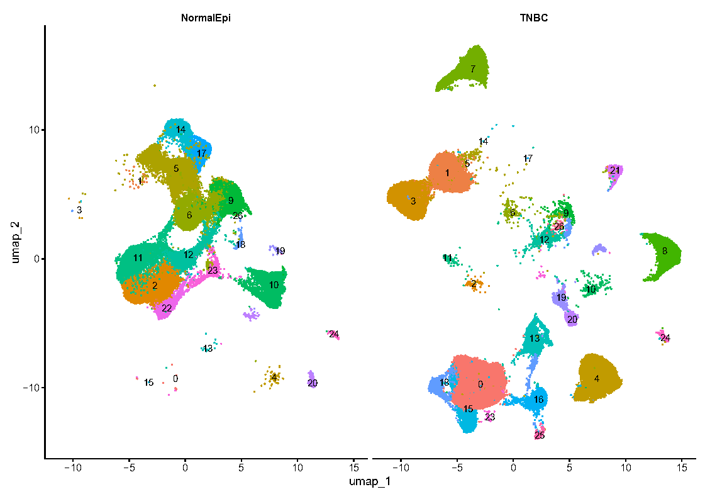
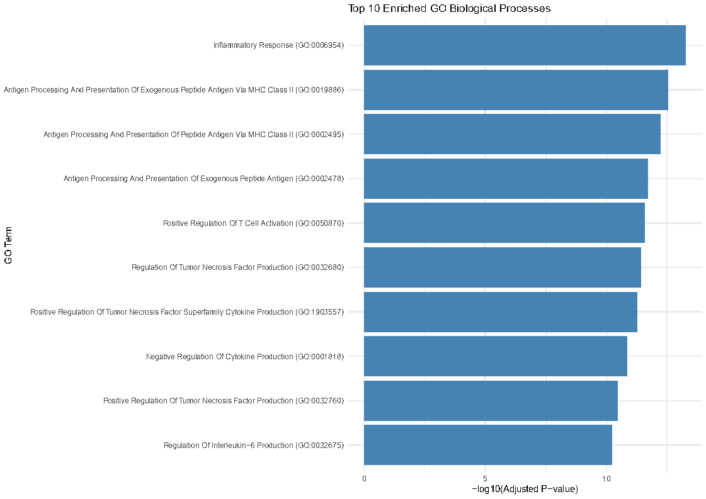

# Triple-Negative Breast Cancer (TNBC) scRNA-seq Analysis — GSE161529

[](https://doi.org/10.5281/zenodo.17127154)
[](LICENSE)

---

## 📖 Overview
This repository contains a **fully reproducible single-cell RNA-seq workflow** for Triple-Negative Breast Cancer (TNBC) versus Normal Epithelial tissue, using the publicly available **GSE161529** dataset.  
The pipeline integrates **quality control, data integration, annotation, differential expression, functional enrichment, and copy number variation (CNV) analysis** into a clear, step-by-step R-based framework.

The goal of this analysis is to **characterize transcriptional changes, pathway activations, and potential CNV-driven drivers of malignancy** in TNBC, with a focus on epithelial cell subtypes.

---

## 🧪 Biological Context
Triple-Negative Breast Cancer (TNBC) is one of the most aggressive breast cancer subtypes, characterized by:

- Lack of ER, PR, and HER2 expression  
- High heterogeneity and poor prognosis  
- Frequent genomic instability and CNV events  

By comparing **TNBC vs. normal epithelial cells** at single-cell resolution, this project:

- Identifies **cell type–specific transcriptional changes**  
- Maps **enriched pathways** linked to tumor aggressiveness  
- Detects **CNV patterns** that may drive tumor progression  

---

## ⚙️ Pipeline Summary
The workflow follows a **modular structure** to ensure clarity and reproducibility.  

**Order of execution:**
1. `01_load_qc.R` — Load raw 10X data, perform QC, and filter cells/genes  
2. `02_integration.R` — Integrate TNBC and normal epithelial datasets using **Seurat RPCA**  
3. `03_annotation_SingleR.R` — Automated cell type annotation with **SingleR** (breast epithelial reference)  
4. `04_markers.R` — Identify cluster-specific markers  
5. `05_de_pseudobulk_edgeR.R` — Pseudobulk differential expression with **edgeR**  
6. `06_enrichment_analysis.R` — Functional enrichment using **enrichR** (GO & KEGG)  
7. `07_cnv_analysis.R` — CNV detection with **CopyKAT** to reveal malignant subpopulations  

---

## 📂 Repository Structure
TNBC_scRNAseq_GSE161529/
│── R/ # Analysis scripts
│── results/
│ ├── figures/ # Plots (UMAP, marker heatmaps, enrichment barplots, CNV maps, etc.)
│ └── tables/ # CSV tables for DEGs, enrichment, CNV calls
│── LICENSE
│── README.md

---

## 🔧 Environment & Dependencies
- **R version:** ≥ 4.3.x  
- **Key packages:**
  - Seurat (v5)  
  - SingleR  
  - celldex  
  - edgeR  
  - data.table, dplyr, ggplot2  
  - enrichR  
  - CopyKAT  

---

## 📊 Example Visuals

### UMAP of TNBC vs Normal epithelial cells


### Pathway Enrichment (GO Biological Process)


---

## 🚀 How to Run

```bash
# Clone repository
git clone https://github.com/somayehsarirchi/TNBC_scRNAseq_GSE161529.git
cd TNBC_scRNAseq_GSE161529

# Run scripts in order
Rscript R/01_load_qc.R
Rscript R/02_integration.R
Rscript R/03_annotation_SingleR.R
Rscript R/04_markers.R
Rscript R/05_de_pseudobulk_edgeR.R
Rscript R/06_enrichment_analysis.R
Rscript R/07_cnv_analysis.R
All outputs will be saved in the results/ folder, organized into tables/ and figures/.

📌 Citation

If you use this repository or scripts, please cite:

Sarirchi, S. (2025). TNBC scRNA-seq Analysis — GSE161529 (v1.0.0). Zenodo.
DOI: 10.5281/zenodo.17127154

📬 Contact

For inquiries or collaboration:
📧 Email: somayeh.sarirchi@gmail.com

🔗 LinkedIn: linkedin.com/in/somayehsarirchi

💻 GitHub: somayehsarirchi


---


